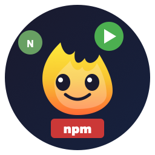
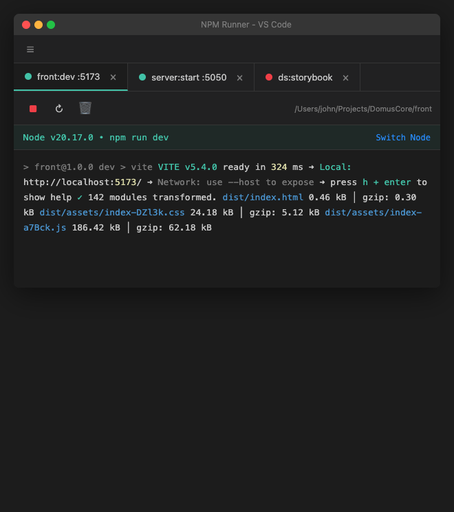
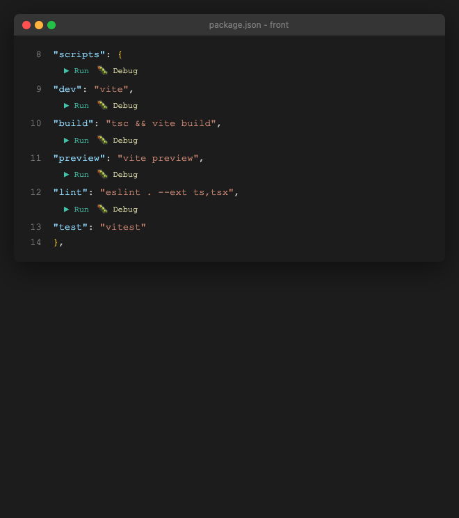

# NPM Runner

Advanced NPM script runner for VS Code, inspired by JetBrains IDEs.



Run and manage NPM scripts with one click, switch Node versions, and track all running processes.

## Screenshots

### Running Scripts Panel


### Play Buttons in package.json


## Features

### Play Buttons in package.json

Click to run any script directly from your package.json file. No terminal commands needed.

- Run button: Execute script normally
- Debug button: Run with Node.js debugger attached
- Works on all package.json files in workspace
- Quick access from CodeLens above each script

### Running Scripts Panel

Manage all running scripts in a dedicated bottom panel.

- Tab for each running script
- Project and script name in tab (front:dev)
- Port number detection (front:dev :5173)
- Real-time output streaming
- Color-coded status: green (running), gray (stopped), red (error)
- Stop, restart, clear output buttons
- Copy output to clipboard
- Execution time display
- Ask AI for help on errors
- Close confirmation with option to kill port

### Node Version Management

Switch Node.js versions per script with nvm integration.

- Shows current Node version before running
- Per-script version memory (persisted)
- Version picker shows installed vs available
- Install missing versions directly from picker
- Supports custom Node paths

### Package.json Watcher

Automatic dependency change detection.

- Monitors all package.json files
- Notifies when dependencies change
- Shows what was added, removed, or updated
- One-click npm install
- Option to choose Node version for install

### Port Management

Handle port conflicts with ease.

- Detects EADDRINUSE errors automatically
- Shows Kill Port button when port is stuck
- One-click to free any blocked port

### Browse All Scripts

Search and run scripts across all projects.

- Quick pick menu with search
- Shows scripts from all package.json files
- Grouped by project name (alphabetically sorted)
- Debug mode available

### Package Manager Support

Run scripts with npm, yarn, or pnpm.

- Auto-detects from lockfile (pnpm-lock.yaml, yarn.lock)
- Manual override via settings
- Shows active package manager in panel

## Installation

### From VS Code Marketplace

1. Open VS Code
2. Go to Extensions (Ctrl+Shift+X on Windows, Cmd+Shift+X on macOS)
3. Search for "NPM Runner"
4. Click Install

### From Open VSX

1. Go to https://open-vsx.org/extension/Yaghobieh/npm-runner
2. Click Install

### From VSIX

```bash
code --install-extension npm-runner-1.0.7.vsix
```

## Usage

### Running Scripts

1. Open any package.json file
2. Click the Run button above any script
3. Or use Command Palette: NPM Runner: Browse All Scripts

### Switching Node Versions

1. Run a script first
2. In the NPM Runner panel, click Switch Node
3. Select from installed versions or install new one
4. Script remembers your choice for next time

### Managing Running Scripts

- View all running scripts in the NPM Runner panel (bottom)
- Click on a tab to see its output
- Use toolbar buttons to stop/restart/clear
- Close tab with X button

### Killing Stuck Ports

When you see a port error:
1. A Kill Port button appears automatically
2. Click it to terminate the process blocking that port
3. Restart your script

## Configuration

| Setting | Default | Description |
|---------|---------|-------------|
| npmRunner.packageManager | auto | Package manager: auto, npm, yarn, or pnpm |
| npmRunner.showNodeVersion | true | Show Node.js version before running |
| npmRunner.defaultNodeVersion | "" | Default Node version (empty = system) |
| npmRunner.confirmOnClose | true | Confirm before closing running script |
| npmRunner.autoScrollOutput | true | Auto-scroll terminal output |

## Keyboard Shortcuts

| Command | Windows and Linux | macOS |
|---------|-------------------|-------|
| Browse All Scripts | Ctrl+Shift+N | Cmd+Shift+N |
| Stop All Scripts | Ctrl+Shift+. | Cmd+Shift+. |
| Open NPM Runner Panel | Click status bar icon | Click status bar icon |

## Requirements

- VS Code 1.85.0 or higher
- Node.js installed
- nvm (optional, for version switching)

## License

MIT License, John Yaghobieh

---

Made by John Yaghobieh
